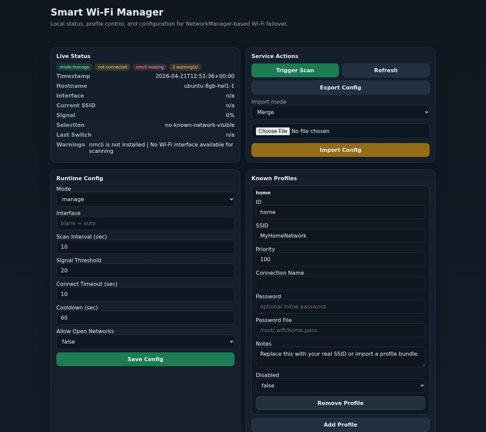

# Smart Wi-Fi Manager

Smart Wi-Fi Manager keeps a Linux companion computer connected to the best
available known Wi-Fi profile using NetworkManager (`nmcli`).

It is built as a standalone product:

- generic Linux companion-computer utility
- structured JSON config
- optional lightweight web dashboard on port `9080`
- install/configure scripts for operators
- file-based status and control surfaces for AI agents and automation
- release-built dashboard binaries with local source-build fallback

This repo is intentionally **not MDS-specific**. MDS can integrate it later as
an optional connectivity backend, but the tool stands on its own.

## Dashboard Preview



The preview uses synthetic SSIDs and status data. Do not publish screenshots
from a customer fleet unless SSIDs, hostnames, addresses, and logs are
sanitized.

## What It Does

- watches Wi-Fi availability through NetworkManager
- tracks the current connection and visible candidate networks
- chooses the best known profile using priority + signal policy
- repairs stale secured NetworkManager profiles before connecting
- switches only when policy says it should
- writes live status to a predictable JSON file
- exposes config/status/logs through a local dashboard/API

## Runtime Model

Canonical files:

- config: `/etc/smart-wifi-manager/config.json`
- status: `/run/smart-wifi-manager/status.json`
- state/control: `/var/lib/smart-wifi-manager`
- logs: `/var/log/smart-wifi-manager/smart-wifi-manager.log`

Modes:

- `manage`: scan and switch
- `observe`: scan/report only, no switching
- `disabled`: stay installed but inactive

## Quick Start

### 1. Clone

```bash
git clone https://github.com/alireza787b/smart-wifi-manager.git
cd smart-wifi-manager
```

### 2. Install

```bash
sudo ./install.sh
```

This installs:

- `smart-wifi-manager.service`
- default config at `/etc/smart-wifi-manager/config.json`
- optional dashboard service on `127.0.0.1:9080`

Dashboard install behavior:

- first tries the published dashboard release asset for the current CPU arch
- falls back to local Go source build if a release asset is unavailable
- can skip the dashboard entirely for minimal installs

Skip the dashboard if you only want the core service:

```bash
sudo ./install.sh --skip-dashboard
```

Expose the dashboard on the LAN or VPN only if you actually want remote access:

```bash
sudo ./install.sh --dashboard-listen 0.0.0.0:9080
```

### 3. Configure

```bash
sudo ./configure_smart_wifi_manager.sh
```

Or headless:

```bash
sudo ./configure_smart_wifi_manager.sh --headless \
  --mode manage \
  --scan-interval 10 \
  --signal-threshold 20 \
  --cooldown 60
```

Import a prepared config bundle:

```bash
sudo ./configure_smart_wifi_manager.sh --headless \
  --import ./my-wifi-config.json \
  --import-mode replace
```

### 4. Verify

```bash
sudo systemctl status smart-wifi-manager.service
cat /run/smart-wifi-manager/status.json
```

If dashboard is installed:

```text
http://127.0.0.1:9080
```

## Config Model

The canonical config is structured JSON. Example:

```json
{
  "version": 1,
  "mode": "manage",
  "interface": "",
  "scan_interval_sec": 10,
  "signal_switch_threshold": 20,
  "connect_timeout_sec": 10,
  "cooldown_sec": 60,
  "allow_open_networks": false,
  "profiles": [
    {
      "id": "home",
      "ssid": "MyHomeNetwork",
      "priority": 100,
      "connection_name": "",
      "password": "",
      "password_file": "/root/.wifi/home.pass",
      "autoconnect": true,
      "disabled": false,
      "notes": "Primary network"
    }
  ]
}
```

### Profile Guidance

Preferred order:

1. use an existing NetworkManager connection name
2. use `password_file`
3. use inline `password` only if you accept that tradeoff

For larger fleets, keep policy in version control and keep secrets out of git by
default.

## Fleet And Profile Bundle Workflow

This tool is intentionally local-first:

- it manages one host
- it reads one canonical config file
- it can import, merge, replace, and export profile bundles
- it does not update itself or other hosts from the dashboard

It does **not** perform multi-node rollout by itself.

For fleet use, the recommended pattern is:

1. keep the non-secret policy bundle in version control
2. keep secrets in local `password_file` paths where possible
3. use an external orchestrator to distribute and apply the bundle
4. use `merge` for additive rollout and `replace` only when you want
   authoritative replacement

### Fleet Default Versus Node Override

For larger fleets, separate the two:

- fleet default bundle:
  - common SSIDs
  - priority order
  - scan policy
  - observe/manage/disabled mode
- node override:
  - one-off local interface differences
  - site-specific emergency profile
  - local password file path if a node cannot share the normal path layout

If a node needs a local override, keep that explicit. Do not silently let local
drift become the new default bundle.

### Import Mode Guidance

- `merge`
  - add or update profiles/settings without treating the imported file as a
    complete replacement
  - preferred for gradual rollout
- `replace`
  - overwrite the full config with the imported bundle
  - use for authoritative resets, image seeding, or known-clean reprovisioning

### Secrets Guidance

For repeatable fleet operations:

- prefer `password_file`
- keep file paths stable when rotating secrets
- avoid inline `password` for long-lived fleet policy bundles
- if you export a config for version control, review it before committing

## Dashboard and API

The dashboard is a thin local UI over the same config/status files.

Main actions:

- inspect service state
- inspect visible networks
- add/edit/remove profiles
- change priorities with immediate-save `Up`, `Down`, and `Prefer` actions
- change runtime policy separately
- import/merge/replace config bundles
- export redacted config
- trigger an immediate scan
- read recent logs

If you use this tool as part of a larger fleet system, the dashboard is still a
single-host control surface. Fleet-wide rollout should come from your external
orchestrator, not by manually editing every node one by one.

When adding a scanned secured SSID, the dashboard opens a profile dialog with a
password field instead of silently creating an unusable blank profile. Stored
inline passwords remain redacted; leave the password field blank while editing
to keep the existing stored secret.

Known profile cards are intentionally read-only. Use `Edit`, `Prefer`, `Up`,
`Down`, or `Remove` so every profile mutation is explicit, saved immediately,
and less likely to be confused with unsaved form state.

Documentation:

- [Dashboard Guide](docs/DASHBOARD.md)
- [CLI Reference](docs/CLI-REFERENCE.md)
- [Troubleshooting](docs/TROUBLESHOOTING.md)

For field operators, the dashboard guide includes exact steps for adding a new
SSID, changing priority, updating a password, disabling a profile, and removing
a profile safely.

The dashboard can also turn a scanned SSID into a known profile. The manager
will only join known profiles, so this keeps Wi-Fi changes auditable instead of
creating one-off manual connections.

## Operator Notes

- This tool assumes `NetworkManager`/`nmcli`.
- It is valid to run it in `observe` mode for diagnostics only.
- If your deployment does not use Wi-Fi, do not install it.
- Do not assume that changing the Wi-Fi that carries your management channel can
  be rolled out safely in one blind step across a fleet. Stage it.
- Exported bundles are useful as fleet-default policy artifacts, but the
  runtime secrets should still be handled separately.

## Development

### Core Validation

```bash
python3 smart_wifi_manager.py validate-config --config templates/config.json.template
python3 -m pytest tests -q
```

### Dashboard Build

```bash
cd dashboard
go build -o smart-wifi-manager-dashboard ./cmd
```

### Installer Validation

```bash
bash -n install.sh configure_smart_wifi_manager.sh smart-wifi-manager.sh
(cd dashboard && go test ./...)
```

## License

Apache License 2.0
